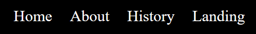
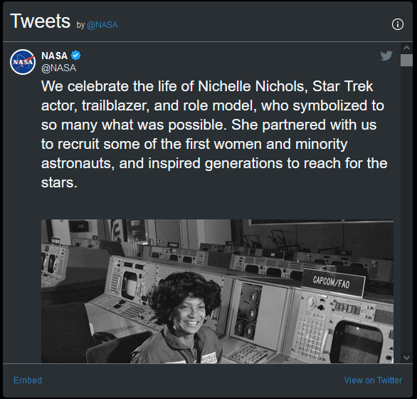
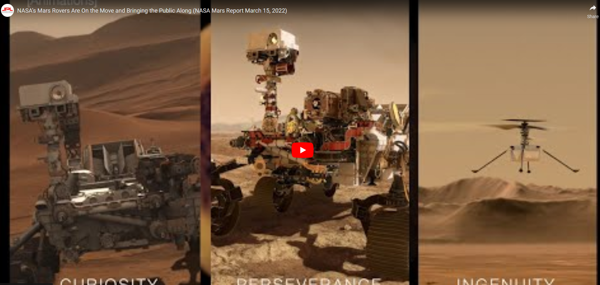

<!-- <h1>Contents</h1>
 -->

<h1>Overview of Project</h1>
'Mars Rover' is a site that is aimed towards landing of the Mars Rover on mars and general facts about NASA. The target audience for this website would be for young adults interested in the world of science from the hype that was created from Space X and Elon Musk.

Click here to see the <a href="endamccabe.github.io/mars-rover">website</a>

<h1>User Experience</h1>
Mars Rover was designed to be a simple website to navigate simply with having a focus on easy to read facts in a seamless design.

<h2>User Stories</h2>
As the end User, I would like to be able to:
<ul>
    <li>Learn about the Mars Rover Project</li>
    <li>Learn what NASA does</li>
    <li>See the Mars Rover Project in action</li>
    <li>Find out who NASA main competitor's are</li>
</ul>

<h1>Colour Scheme</h1>

For the colour scheme I went to <a href="https://mycolor.space/">https://mycolor.space/</a> in preparation of this project.

A black theme was chosen for this website as I believed it would suit the theme of NASA and space. Then I chose the Twisted Spot Palette as the generated gradient to made by the mycolor.

I decided for a simple use of #00C9C8 as the background color for the footer in this project. For the anchor links I used #47817F as I believe it had a nice look on the eyes when moving to different webpages. I decided against using #BFFCF9 as the main text color and stayed with using white instead as it seemed to take away from the feel of the website.

<h1>Features</h1>

<h2>Navigation bar</h2>

<ul>
    <li>This is featured on every page and uses a consistent design across every page</li>
    <li>The links seen on the navigation bar are the Home, About, History and Landing links</li>
    <li>The logo of NASA is seen to the left of the links</li>
</ul>

<h2>NASA Twitter Feed</h2>

<ul>
    <li>This is featured on the home page of the website</li>
    <li>This has a dark theme to mimic the feel of the website</li>
    <li>This is updated everytime that NASA tweets</li>
</ul>

<h2>Youtube Video</h2>

<ul>
    <li>This is featured on the Landing page.</li>
    <li>This shows the user some content on the Mars Rover</li>
</ul>

<h2>Footer</h2>

<ul>
    <li>Our footer includes a link to real NASA website if the user would be interested in looking up for more information on anything else that NASA does</li>
    <li>This is featured on every page.</li>
</ul>

<h1>Features left to Implement</h1>
<ol>
    <li>A form page that users could use to get in contact and leave feedback</li>
    <li>More videos showing the journey that the mars rover project has gone through the year</li>
    <li>A map showing the areas that work in and showing how many people work for NASA</li>
    <li>A page dedicated to what NASA's research has led to inventing</li>
</ol>

<h1>Technologies Used</h1>
<ul>
    <li>HTML5</li>
    <li>CSS</li>
    <li>Gitpod</li>
    <li>Git</li>
    <li>Github</li>
</ul>

<h1>Testing</h1>

Validated HTML and css from the w3c validators for them and errors did not show up. Tested good.

<h1>Deployment</h1>

Github Pages was used to deploy this website

<ol>
    <li>Click "Settings" tab in the Github respository</li>
    <li>Click "Pages" on the left hand side</li>
    <li>Find "Source" and choose the main branch</li>
    <li>Click "Save"</li>
    <li>After this the website should be deployed</li>
</ol>

<h1>Creating a local clone of the Project</h1>

if you would like to clone my project i will give you the git command on how to do so

<ul>
    <li>git clone https://github.com/EndaMcCabe/nasa-rover.git</li>
</ul>